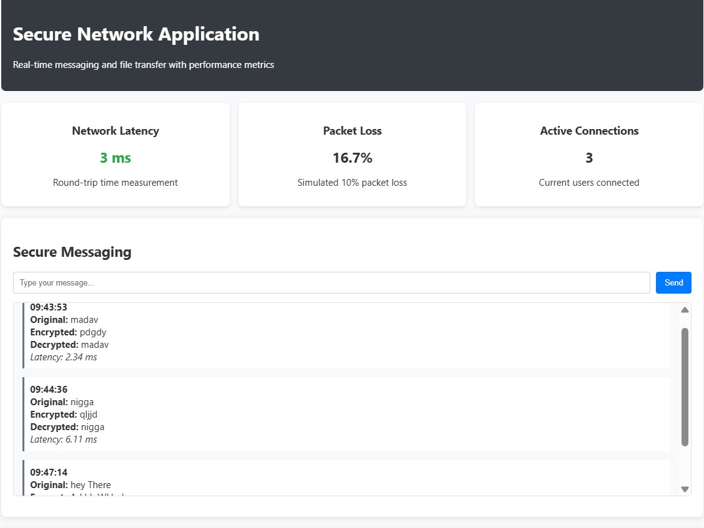

# 🔐 Secure Chat Application with File Upload and Performance Metrics

This mini-project is a real-time **secure chat application** with integrated **file upload**, **Caesar cipher encryption**, and **performance monitoring** (latency, throughput, and packet drop simulation). It is designed for **Data Communication Networks Lab** and can be run between two PCs over a LAN or localhost.

---
### 💬 Chat Interface

### 📁 File Upload and Metrics

## 📌 Features

- 🔒 Encrypted chat using Caesar cipher (shift = 3)
- 📁 File upload with real-time status and download link
- 📊 Metrics for:
  - Message latency (ms)
  - File transfer latency and throughput (KB/s)
  - Simulated 10% packet drop during file upload
- 📡 Socket.IO-based real-time communication
- 🧮 Dynamic charts for performance monitoring using Chart.js

---

## ⚙️ Tech Stack

- Python Flask + Flask-SocketIO
- HTML + CSS + JavaScript
- Chart.js (for graphs)
- Caesar Cipher (for encryption/decryption)

---

## 📁 Folder Structure
project/
│
├── app2.py # Main Flask server
├── templates/
│ └── index2.html # Main UI page
├── static/
│ └── style.css
├── uploads/ # Folder to store uploaded files

## Requirements
Run the below command
-pip install flask flask-socketio eventlet

## 🌐 Running on Two PCs
Ensure both PCs are connected on the same LAN.
Get the IP address of the host PC using ipconfig (Windows) or ifconfig (Linux/macOS).
## On the host PC, run:
- python app.py
## On the client PC, open the browser and go to:
- http://host_IP:5000

